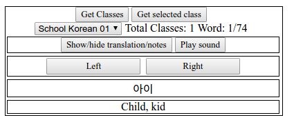

#Javascript tool to help language study and vocabulary recall

This is a JS file that loads a two column Json file from google spreadsheets publish as website. This json file contains in the first column the words or grammar in a foreign language and the second column the explanation or translation of it. 

The js file loads this "dictionary" into a table. The table has a **Get Classes** button that loads a pair of "Class name", "google key". This loads a **select** input with the content found. Once this field is populated the **Get selected class** should be pressed. This last option loads the pair of words into the table.

 A **Show/Hide translation/notes** button is present to hide the native language notes/translation. This is  useful when training memory in order to recall the meaning of the foreign word.
 
 A **Play sound** button is added in order to play the Google translator pronounciation of the foreign language field. It is set by default Korean. The Url of languages available are listed in [Google TTS languages](//https://cloud.google.com/speech/docs/languages)  .
 
 In addition, a **left** and **right** buttons are included. These allow the navigation through the class pairs.

A working example can be found in one of my blogs [Learning blog](http://learnlangtool.blogspot.pe/) . I created this js file and blog in order to improve my study.